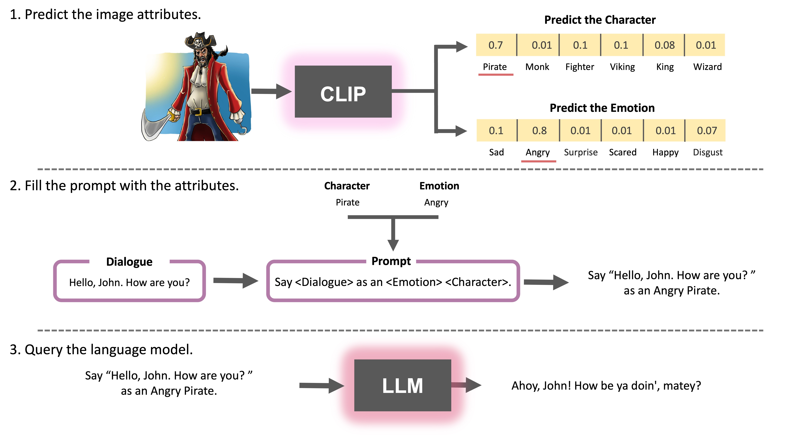

<!-- PROJECT LOGO -->
<br />
<div align="center">
  <a href="https://github.com/othneildrew/Best-README-Template">
    
  </a>

  <h3 align="center">Style My Dialougue</h3>

  <p align="center">
    Style a given dialogue based on the characteristics of a chosen character's protrait, sketch or image. 
    <br />
    <a href="https://stylemydialouge.streamlit.app"><strong>View Demo»</strong></a>
  </p>
</div>


<!-- ABOUT THE PROJECT -->
## About The Project

Style My Dialogue is a Streamlit app and workflow that allows users to style a given dialogue based on the characteristics of a chosen character. The app uses OpenAI's GPT-3 API and CLIP model to classify the image of a character and generate a styled dialogue that matches their characteristics.

Contributions are:
* Automatic naration and storytelling: This app can be used as a tool to help writers and storytellers generate new ideas and dialogue for their stories, and to explore different character personalities and styles.
* Showcasing the power of AI in dailouge generationg and stylization: This app demonstrates the capabilities of cutting-edge natural language processing and computer vision models to generate context-aware and creative dailouges.
* Providing a fun and interactive way for users to experiment with these models: By allowing users to upload their own images and enter their own dialogues, this app enables users to play with the models and see their outputs in real-time.


<!-- GETTING STARTED -->
## Getting Started

Guide for installing the program and its dependencies.


### Installation

1. Get a free API Key from openai at [https://openai.com/blog/openai-api](https://openai.com/blog/openai-api)

2. Clone the repo
   ```sh
   git clone https://github.com/MakanFar/StyleMyDialogue.git
   ```
3. Install all the dependecies using pip
   ```sh
   pip install -r requirements.txt
   ```
4. Enter your API in `config.yml`
   ```yml
   api_key: "Write chatgpt api here"
   ```


<!-- USAGE -->
## Usage

This a tutoiral on how to run the project localy to duplicate the results or even start generating your own dailogues.

1. Locate the root folder
   ```sh
   cd StyleMyDialogue
   ```

2. Run the main file
   ```sh
   python main.py
   ```

That's it! now the new stylized outputs with the original generic prompts are in the results.csv

Currently dailogues are randomly genrated using a the DailyDailouges dataset, but you can change the dailouges, by changing it from the config file.

Enter your own dailogues in `config.yml`
```yml
 dialogues: "dailogue list or dataset"
```

Characters, emotions, and images can also be changed by their csv files in the data folder, or changing the variable paths from the config file.

Enter your own images in `config.yml`
```yml
 images: "image list or dataset"
```

Enter your own characters in `config.yml`
```yml
 characters: "character list or dataset"
```

Enter your own emotions in `config.yml`
```yml
 emotions: "emotion list or dataset"
```

